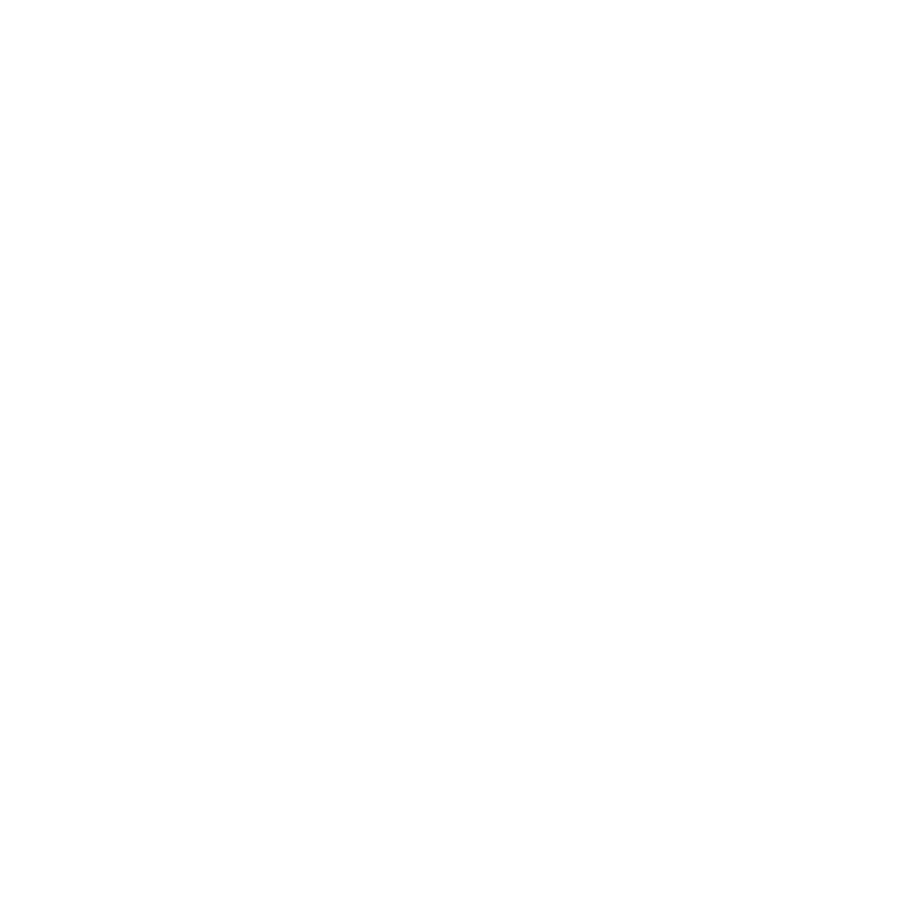

# QRaft

[](https://flutter.dev)
[](https://firebase.google.com)
[](https://supabase.com)

**QRaft** is a comprehensive Flutter application for QR code generation, scanning, and physical marketplace integration. Create personalized QR codes and order laser-engraved physical products through an integrated marketplace using XTool F1 Ultra laser machine.



## ✨ Features

### 🎯 Core Functionality
- **QR Generation**: Create QR codes for personal info, URLs, WiFi, vCards, events, locations
- **QR Scanner**: Advanced camera-based scanning with history management
- **Visual Customization**: Personalize QR appearance with colors, logos, and templates
- **Template Library**: Pre-designed QR templates for various use cases

### 🛒 Marketplace Integration
- **Physical Products**: Order laser-engraved QR codes on premium materials
- **Material Options**: Wood, acrylic, metal, leather, glass, stone
- **XTool F1 Ultra**: Professional laser engraving integration
- **Order Tracking**: Complete order management and delivery tracking

### 👤 User Experience
- **Firebase Authentication**: Secure user registration and login
- **Profile Management**: Personal settings and preferences
- **Dark Theme**: Carden Pro design system with neon accents
- **Cross-Platform**: iOS, Android, Web, and Desktop support

## 🎨 Design System

QRaft follows the **Carden Pro** design language featuring:

- **Primary Colors**: 
  - Cobalt Blue `#1A73E8` - Technology and innovation
  - Neon Green `#00FF88` - Energy and progress
  - Graphite `#2E2E2E` - Professional base
- **UI Patterns**: Glassmorphism, elevated cards, smooth animations
- **Dark Theme**: Modern dark interface with strategic neon accents
- **Animations**: flutter_animate powered micro-interactions

## 🚀 Quick Start

### Prerequisites

- Flutter SDK 3.6.2 or higher
- Dart SDK 3.0.0 or higher
- Firebase project setup
- Supabase project (for production)

### Installation

1. **Clone the repository**
   ```bash
   git clone https://github.com/fricred/QRaft.git
   cd QRaft
   ```

2. **Install dependencies**
   ```bash
   flutter pub get
   ```

3. **Firebase Configuration**
   - Add `google-services.json` to `android/app/`
   - Add `GoogleService-Info.plist` to `ios/Runner/`

4. **Environment Setup (New 2025 Method)**
   ```bash
   # Copy environment template
   cp env.example.json env.json
   
   # Edit env.json with your credentials
   {
     "SUPABASE_URL": "https://your-project-id.supabase.co",
     "SUPABASE_ANON_KEY": "your-anon-key-here"
   }
   ```

5. **Run the application**
   ```bash
   # Development (with environment)
   flutter run --dart-define-from-file=env.json
   
   # Web browser (with environment)
   flutter run --dart-define-from-file=env.json -d chrome
   
   # VS Code: Just press F5 (auto-configured)
   # Android Studio: Use "QRaft (Development)" run config
   ```

## 🏗️ Architecture

QRaft follows **Clean Architecture** principles with **Riverpod** state management:

```
lib/
├── main.dart                    # App entry point
├── app/                         # App configuration
│   ├── router/                  # Go Router navigation
│   └── theme/                   # Material 3 theming
├── core/                        # Shared utilities
│   ├── constants/               # App constants
│   ├── utils/                   # Helper functions
│   └── errors/                  # Error handling
├── features/                    # Feature modules
│   ├── auth/                    # Firebase Authentication
│   ├── splash/                  # Animated splash screen
│   ├── qr_generation/           # QR creation logic
│   ├── qr_scanner/              # Scanning functionality
│   ├── marketplace/             # E-commerce integration
│   └── profile/                 # User management
└── shared/                      # Reusable components
    ├── widgets/                 # Common UI widgets
    └── providers/               # Global state providers
```

### Key Technologies

- **Frontend**: Flutter with Material 3 design
- **State Management**: Riverpod for reactive state
- **Authentication**: Firebase Auth
- **Backend**: Supabase (PostgreSQL + Edge Functions)
- **Storage**: Firebase Storage + Supabase Storage
- **Animations**: flutter_animate for advanced effects
- **Graphics**: flutter_svg for vector graphics

## 📱 Development

### Available Commands

```bash
# Development
flutter run                     # Run app in debug mode
flutter run --hot-reload       # Enable hot reload
flutter devices                # List available devices

# Code Quality
flutter analyze                # Static code analysis
flutter test                   # Run unit and widget tests
flutter test --coverage        # Run tests with coverage

# Building
flutter build apk              # Android APK
flutter build ios              # iOS app (macOS required)
flutter build web              # Web application
flutter build macos            # macOS desktop app
flutter build windows          # Windows desktop app
flutter build linux            # Linux desktop app

# Maintenance
flutter clean                  # Clean build artifacts
flutter pub upgrade            # Update dependencies
flutter doctor                 # Check development setup
```

### Testing

```bash
# Run all tests
flutter test

# Run specific test file
flutter test test/features/auth/auth_test.dart

# Run tests with coverage
flutter test --coverage
```

## 🚀 Deployment

### Android
1. Configure signing in `android/app/build.gradle`
2. Build release APK: `flutter build apk --release`
3. Build App Bundle: `flutter build appbundle --release`

### iOS
1. Configure signing in Xcode
2. Build release: `flutter build ios --release`
3. Archive and distribute through Xcode

### Web
1. Build web app: `flutter build web --release`
2. Deploy to Firebase Hosting or preferred platform

## 🗺️ Roadmap

### Phase 1: MVP (Current)
- ✅ Firebase Authentication setup
- ✅ Splash screen with animations
- ✅ Custom logo and app icons
- 🔄 Login/Register screens
- 🔄 Basic QR generation
- 🔄 QR scanner implementation

### Phase 2: Enhancement
- Advanced QR customization
- Template library
- Marketplace catalog
- Shopping cart and checkout
- Order management

### Phase 3: Polish
- Analytics integration
- Social sharing features
- Premium features
- Performance optimization
- Advanced customization

## 🤝 Contributing

1. Fork the repository
2. Create a feature branch: `git checkout -b feature/amazing-feature`
3. Commit changes: `git commit -m 'Add amazing feature'`
4. Push to branch: `git push origin feature/amazing-feature`
5. Open a Pull Request

## 📄 License

This project is licensed under the MIT License - see the [LICENSE](LICENSE) file for details.

## 🔗 Links

- **Repository**: [github.com/fricred/QRaft](https://github.com/fricred/QRaft)
- **Issues**: [Report bugs or request features](https://github.com/fricred/QRaft/issues)
- **Flutter Documentation**: [docs.flutter.dev](https://docs.flutter.dev)
- **Firebase Console**: [console.firebase.google.com](https://console.firebase.google.com)

---

**Built with ❤️ using Flutter and Firebase**